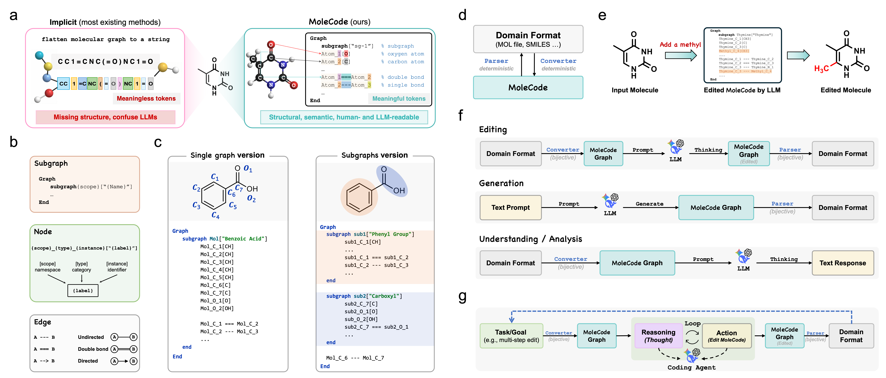
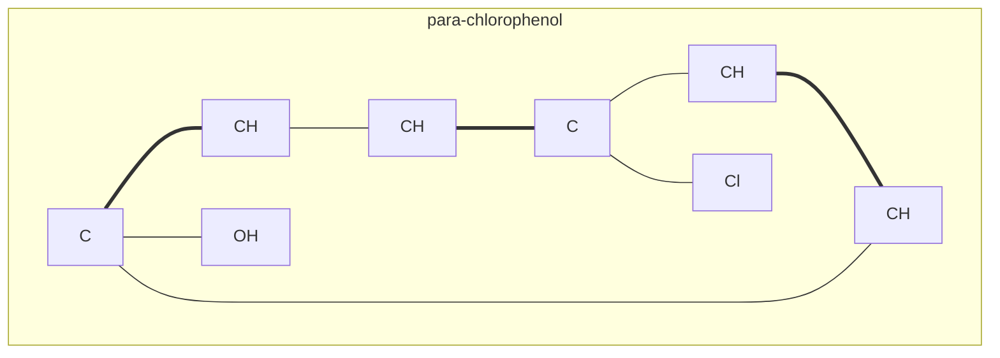
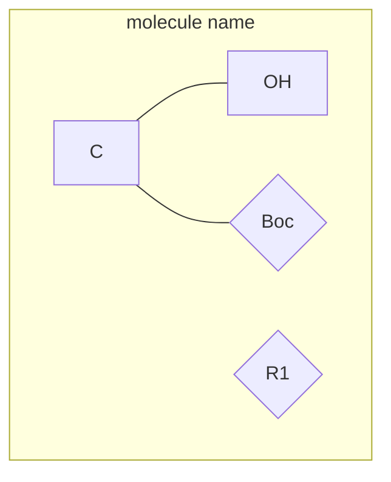
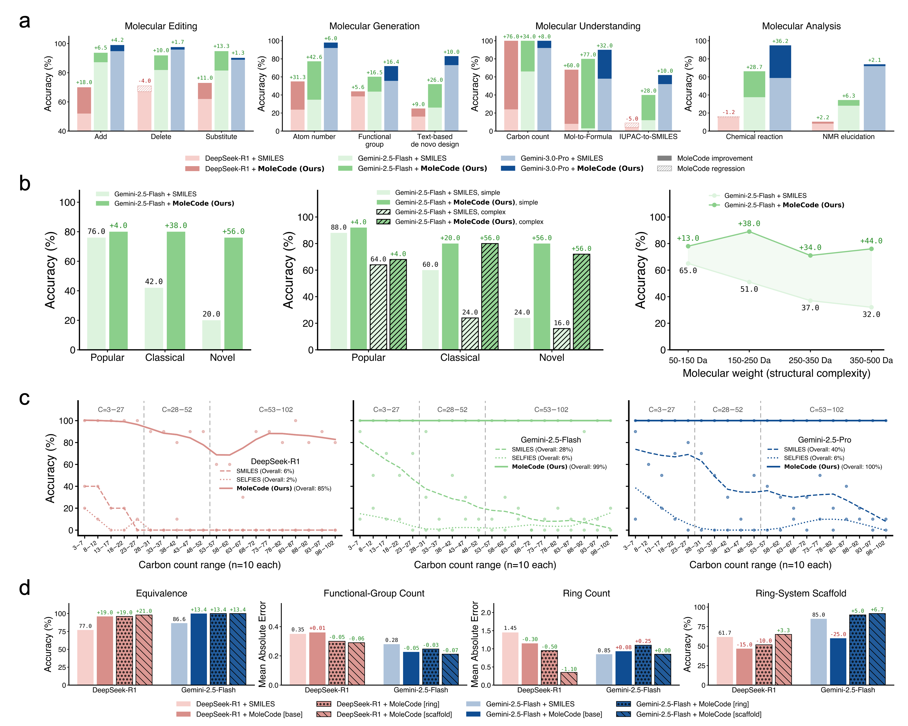
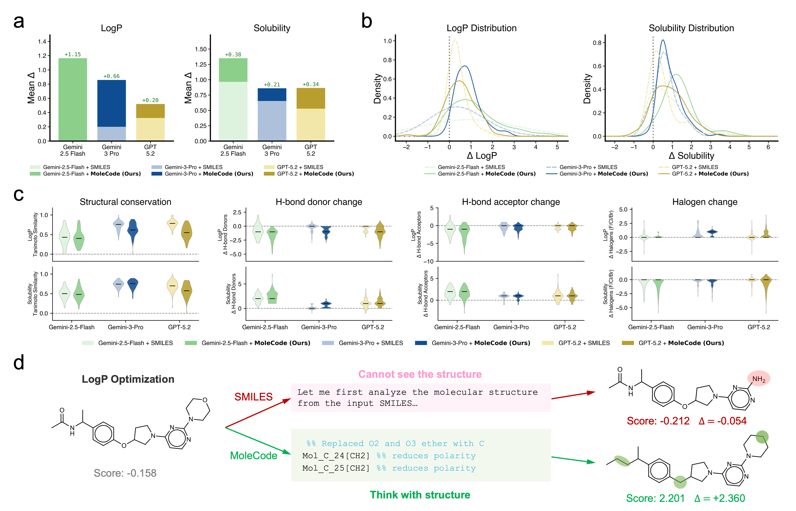
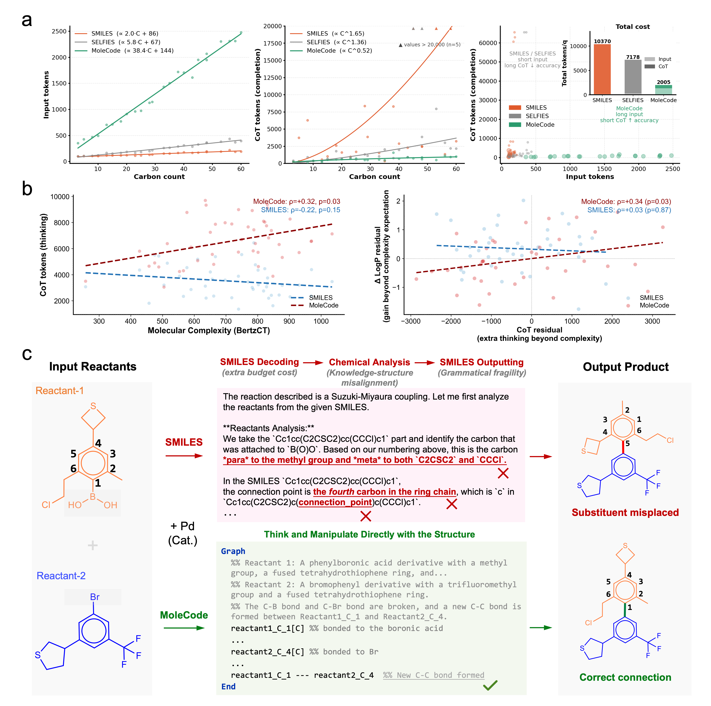
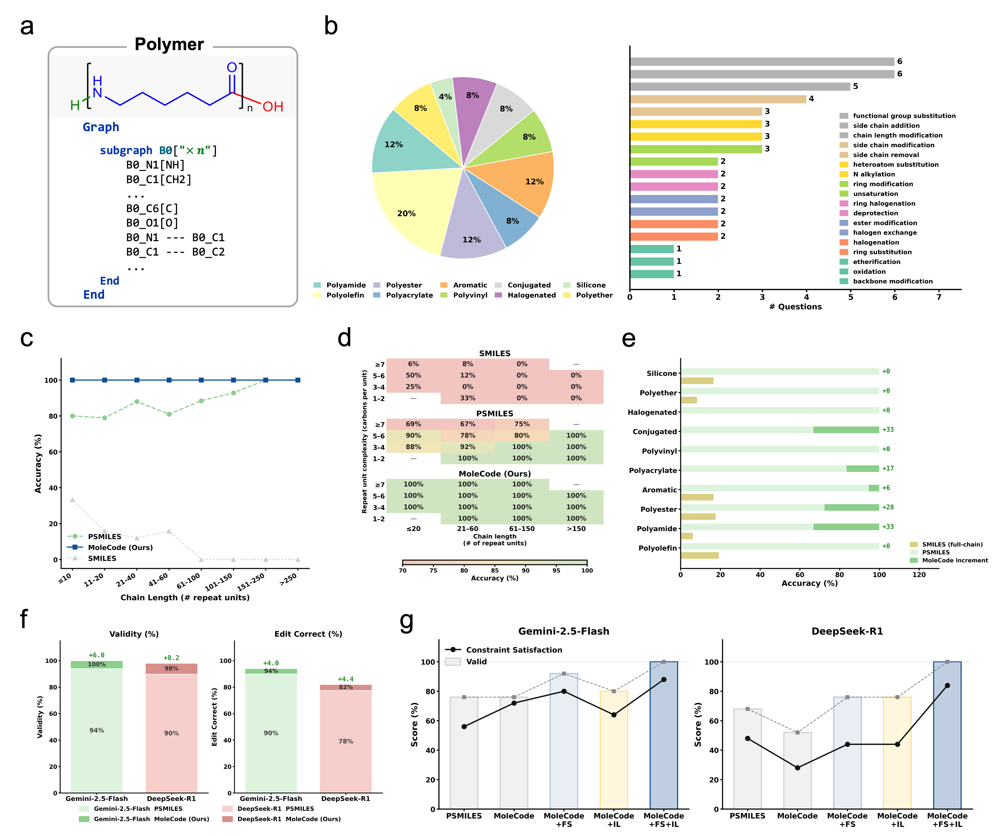
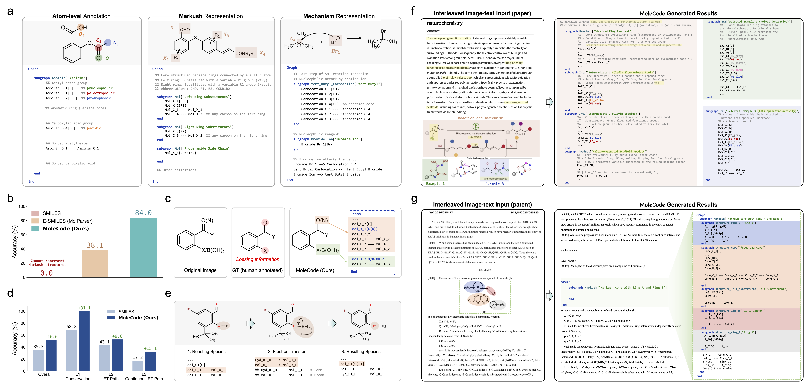

<div align="center">

# 🧬 MoleCode

### An LLM-native, graph-explicit molecular language

*Stop making language models reconstruct molecular structure from cryptic strings — let them read, write, and edit structure directly.*

[](LICENSE)
[](https://www.python.org/)
[](https://www.rdkit.org/)



</div>

---

## What is MoleCode?

A molecule **is** a graph: atoms are nodes, bonds are edges, and chemistry emerges from the topology. Yet large language models are almost always fed molecules as *linear strings* like SMILES, where the graph is **implicit** — connectivity is positional, branches are syntactic, and rings hide inside index digits. Before an LLM can do any chemistry, it must first *reconstruct the graph from the syntax*, spending reasoning budget on structural bookkeeping.

**MoleCode makes the structure the language.** Every atom and bond is written as a typed declaration with a persistent identifier, serialized as a [Mermaid](https://mermaid.js.org/) graph. Topology becomes directly readable, editable, and auditable inside the context window — and the format is **deterministically and losslessly inter-convertible with SMILES / MOL via RDKit** (no learned model, no information loss).



> The same `Subgraph → Node → Edge` grammar covers **small molecules, polymers, and Markush structures** — and extends to reaction mechanisms and multimodal document parsing.

---

## Why it matters

| | SMILES | **MoleCode** |
| --- | --- | --- |
| Topology | implicit, positional | **explicit, named nodes & edges** |
| Atom identity | none | **persistent IDs** (stable across prompt → reasoning → output) |
| Editing | whole-string rewrite | **local graph op** (add a methyl = 1 node + 1 edge) |
| Validation | fragile string parsing | **deterministic RDKit round-trip** |
| Reasoning behavior | memorizes syntax | **generalizes over structure** |

Empirically (see the [MoleCode paper](#-citation) and [docs/06-why-it-works.md](docs/06-why-it-works.md)):

- **Generalization, not memorization.** SMILES accuracy collapses from ~42% on familiar molecules to ~20% on novel ones; MoleCode holds **~76–80%** across all familiarity tiers.
- **Cheaper reasoning.** MoleCode has longer *input* but its chain-of-thought grows **sub-linearly** with molecule size (~C^0.52) versus SMILES' super-linear ~C^1.65 — about a **5× lower total token cost** per query.
- **Scales to big, repetitive objects.** Full-chain SMILES accuracy falls toward **0%** as polymer chains grow; MoleCode stays flat.
- **Markush understanding** jumps from **38.1% → 84.0%**.

---

## Install

```bash
git clone https://github.com/AtomFlow-AI/MoleCode.git
cd MoleCode
pip install -e .          # installs rdkit + networkx
```

## Quick start

```python
from rdkit import Chem
from molecode import mol_to_mermaid, mermaid_to_mol, mol_to_smiles

# SMILES  ->  MoleCode graph
graph = mol_to_mermaid(Chem.MolFromSmiles("CC(=O)Oc1ccccc1C(=O)O"), name="Aspirin")
print(graph)

# MoleCode graph  ->  SMILES  (lossless round-trip)
assert mol_to_smiles(mermaid_to_mol(graph)) == Chem.CanonSmiles("CC(=O)Oc1ccccc1C(=O)O")
```

---

## Three domains, one grammar

### 🧪 Small molecules — [`molecode.molecule`](molecode/molecule)

Atoms are `prefix_Element_Number[Label]` nodes; bonds are `---` (single), `===` (double), `-.-` (triple), with `===|E|`/`===|Z|` and `_R`/`_S` for stereochemistry. → [syntax reference](docs/02-syntax.md)

### 🔗 Polymers — [`molecode.polymer`](molecode/polymer)

The repeat unit stays **explicit** as a subgraph carrying a symbolic `×n` count, with `TL`/`TR` terminus markers — so the graph does not blow up with chain length. → [polymer docs](docs/03-polymers.md)

```python
from molecode.polymer import polymer_to_mermaid, mermaid_to_psmiles

graph = polymer_to_mermaid("*NCCCCCC(=O)*", n=8, name="Nylon-6")   # PSMILES -> graph
mermaid_to_psmiles(graph)                                          # -> '*NCCCCCC(=O)*'
```

### 🧩 Markush structures — [`molecode.markush`](molecode/markush)

Variable R-groups and named substituents become **abbreviation nodes** in curly braces — `{R1}`, `{Boc}`, `{Ar}` — something plain SMILES cannot express. A built-in graph-isomorphism comparator scores predictions up to abbreviation expansion. → [Markush docs](docs/04-markush.md)



---

## Run the tasks: understand · generate · edit · reason

MoleCode is a **drop-in representation for any LLM** — feed the grammar as a system prompt, hand the model a graph, and validate its output deterministically. The [`examples/`](examples) folder has runnable scripts for all four task families (they run **offline by default**, printing the exact prompt; set `MOLECODE_API_KEY` to call a model):

```bash
python examples/01_molecule_roundtrip.py   # SMILES <-> graph (lossless)
python examples/02_polymer_roundtrip.py    # polymers with ×n
python examples/03_markush_roundtrip.py    # abbreviation nodes & isomorphism
python examples/04_understanding.py        # count atoms / formula / rings ...
python examples/05_generation.py           # de novo design under constraints
python examples/06_editing.py              # local graph edits (add/del/substitute)
python examples/07_reasoning.py            # reaction-product prediction
```

The reusable ingredients:

```python
from molecode.prompts import MOLECULE_SYSTEM_PROMPT   # give this to the LLM as the system prompt
from molecode.molecule import mol_to_mermaid          # your molecule -> what the model reads
from molecode.molecule import mermaid_to_mol           # model output -> validated RDKit Mol
```

See [docs/05-tasks.md](docs/05-tasks.md) for the full task catalog.

| Domain | Understanding | Generation | Editing | Reasoning |
| --- | :---: | :---: | :---: | :---: |
| Molecules | ✅ | ✅ | ✅ | ✅ |
| Polymers | ✅ | ✅ | ✅ | — |
| Markush | ✅ | — | — | — |

---

## Repository layout

```
molecode/                # the library (pip-installable)
├── molecule/            # small-molecule  <-> Mermaid  (rdkit_to_mermaid, mermaid_to_rdkit)
├── polymer/             # polymer         <-> Mermaid  (polymer_to_mermaid, mermaid_to_psmiles)
├── markush/             # Markush         <-> Mermaid  + egl_graph isomorphism + abbreviation_map
└── prompts/             # LLM system prompts (molecule + markush grammars)
examples/                # 7 runnable demos (round-trips + 4 task families)
docs/                    # overview, syntax, polymers, markush, tasks, why-it-works
```

---

## Results at a glance

| Generalization & reasoning | Goal-directed design | Scaling | Long molecules | General language |
| :---: | :---: | :---: | :---: | :---: |
|  |  |  |  |  |

---

## 📚 Citation

If you use MoleCode in your research, please cite the MoleCode technical report:

```bibtex
@techreport{molecode2026,
  title  = {MoleCode: An LLM-Native, Graph-Explicit Molecular Language},
  author = {AtomFlow-AI},
  year   = {2026},
  institution = {AtomFlow-AI},
  url    = {https://github.com/AtomFlow-AI/MoleCode}
}
```

## License

[MIT](LICENSE) © 2026 AtomFlow-AI
